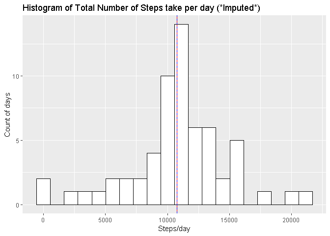
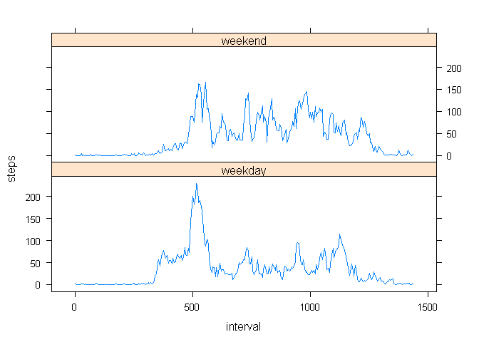

## Loading and preprocessing the data

Ensure file is downloaded and data loaded into Global Environment

```r
  library(dplyr)
```

```
## 
## Attaching package: 'dplyr'
```

```
## The following objects are masked from 'package:stats':
## 
##     filter, lag
```

```
## The following objects are masked from 'package:base':
## 
##     intersect, setdiff, setequal, union
```

```r
  library(ggplot2)
  library(lattice)
  
  download.file("https://d396qusza40orc.cloudfront.net/repdata%2Fdata%2Factivity.zip",
                  destfile = "./activity.zip")
  unzip("activity.zip")
  data <- read.csv("activity.csv", colClasses = c("integer", "Date", "integer"))
  
  data$interval <- (60*(data$interval %/% 100)) + (data$interval %% 100)
  
  str(data)
```

```
## 'data.frame':	17568 obs. of  3 variables:
##  $ steps   : int  NA NA NA NA NA NA NA NA NA NA ...
##  $ date    : Date, format: "2012-10-01" "2012-10-01" ...
##  $ interval: num  0 5 10 15 20 25 30 35 40 45 ...
```

```r
  summary(data)
```

```
##      steps             date               interval     
##  Min.   :  0.00   Min.   :2012-10-01   Min.   :   0.0  
##  1st Qu.:  0.00   1st Qu.:2012-10-16   1st Qu.: 358.8  
##  Median :  0.00   Median :2012-10-31   Median : 717.5  
##  Mean   : 37.38   Mean   :2012-10-31   Mean   : 717.5  
##  3rd Qu.: 12.00   3rd Qu.:2012-11-15   3rd Qu.:1076.2  
##  Max.   :806.00   Max.   :2012-11-30   Max.   :1435.0  
##  NA's   :2304
```

## What is mean total number of steps taken per day?
1. Ignoring missing values, calculate total number of steps per day (present in a histogram)

```r
Steps <- data %>% group_by(date) %>% summarise(Steps=sum(steps))

ggplot(Steps,aes(Steps)) + 
  geom_histogram(na.rm=TRUE, color="black", fill="white", bins = 20) +
  ggtitle("Histogram of Total Number of Steps take per day") +
  xlab("Steps/day") +
  ylab("Count of days")
```

<!-- -->

2. Calculate and report the **mean** and **median** total number of steps taken per day

```r
mean(Steps$Steps, na.rm = TRUE)
```

```
## [1] 10766.19
```

```r
median(Steps$Steps, na.rm = TRUE)
```

```
## [1] 10765
```
The mean total steps per day = 10766.19
The median total steps per day = 10765

## What is the average daily activity pattern?
1. Make a time series plot (i.e. type="l") of the 5-minute interval (x-axis) and the average number of steps taken, averaged across all days (y-axis)


```r
daily <- tapply(data$steps, data$interval, mean, na.rm=TRUE)

hours <- as.numeric(names(daily))/60

plot(hours, daily, type = "l", axes=F)
axis(2)
axis(1, at=0:6*4, labels=paste(0:6*4,":00", sep=""))
abline(v=8.5833333, col="red")
```

<!-- -->

2. Which 5-minute interval, on average across all the days in the dataset, contains the maximum number of steps?


```r
int <- data$interval[which.max(daily)]
sprintf("%02d:%02d", int%/%60, int%%60)
```

```
## [1] "08:35"
```

The 5 minute interval with the max number of steps (on averge across all days) was the 5-minute interval starting at 8:35 AM. Red line added to above graph to illustrate the beginning of this time interval.

## Imputing missing values

Note that there are a number of days/intervals where there are missing values (coded as **NA**). The presence of missing days may introduce bias into some calculations or summaries of the data.

-  Calculate and report the total number of missing values in the dataset (i.e. the total number of rows with **NA**s)

```r
sum(is.na(data$steps))
```

```
## [1] 2304
```

```r
sum(is.na(data$date))
```

```
## [1] 0
```

```r
sum(is.na(data$interval))
```

```
## [1] 0
```
      There are a total of 2,304 "NA" values in the steps column, and no NA values in the date or interval columns.

-  Devise a strategy for filling in all of the missing values in the dataset. The strategy does not need to be sophisticated. For example, you could use the mean/median for that day, or the mean for that 5-minute interval, etc.
      I will use the mean for that time interval across all days (already calculated in the 'daily' vector).
      
-  Create a new dataset that is equal to the original dataset but with the missing data filled in.

```r
##naming the dataframe "ID", short for "Imputed Data"

ID <- transform(data, steps=
                  ifelse(
                    is.na(steps),
                    daily,
                    steps
                  )
)
sum(is.na(ID$steps))
```

```
## [1] 0
```

-  Make a histogram of the total number of steps taken each day and Calculate and report the mean and median total number of steps taken per day. Do these values differ from the estimates from the first part of the assignment? What is the impact of imputing missing data on the estimates of the total daily number of steps?

```r
ImpSteps <- ID %>% group_by(date) %>% summarise(isteps=sum(steps))

ggplot(ImpSteps,aes(isteps)) + 
  geom_histogram(na.rm=TRUE, color="black", fill="white", bins = 20) +
  ggtitle("Histogram of Total Number of Steps take per day (*Imputed*)") +
  xlab("Steps/day") +
  ylab("Count of days") +
  geom_vline(xintercept = 10766.19, color="red") +
  geom_vline(xintercept = 10766.19, color="blue", linetype="dashed")
```

<!-- -->

```r
mean(ImpSteps$isteps)
```

```
## [1] 10766.19
```

```r
median(ImpSteps$isteps)
```

```
## [1] 10766.19
```

The impact of imputing was to make the mean and median values closer together (in effect, strengthened the central values which were already present).

## Are there differences in activity patterns between weekdays and weekends?
For this part the weekdays() function may be of some help here. Use the dataset with the filled-in missing values for this part.

1. Create a new factor variable in the dataset with two levels - "weekday" and "weekend" indicating whether a given date is a weekday or weekend day.

```r
ID <- ID %>% 
  mutate(weekday=factor(weekdays(ID$date) %in% c("Saturday","Sunday"), 
               labels=c("weekday","weekend"), 
               ordered=FALSE))
```
2. Make a panel plot containing a time series plot (i.e. type="l") of the 5-minute interval (x-axis) and the average number of steps taken, averaged across all weekday days or weekend days (y-axis). See the README file in the GitHub repository to see an example of what this plot should look like using simulated data.


```r
ID1 <- aggregate(steps~ interval + weekday, ID, mean)

xyplot(
  steps ~ interval | weekday, 
  data = ID1,
  type = "l",
  layout=c(1,2))
```

<!-- -->
